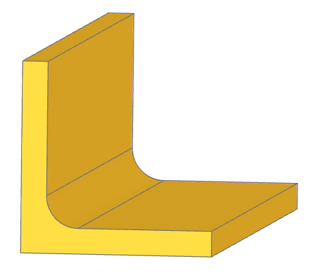

Transitioning from OpenSCAD
===========================

Welcome to build123d! If you're familiar with OpenSCAD, you'll notice key differences in 
how models are constructed. This guide is designed to help you adapt your design approach 
and understand the fundamental differences in modeling philosophies. While OpenSCAD relies 
heavily on Constructive Solid Geometry (CSG) to combine primitive 3D shapes like cubes and 
spheres, build123d encourages a more flexible and efficient workflow based on building 
lower-dimensional objects.

Why Transition to build123d?
----------------------------

Transitioning to build123d allows you to harness a modern and efficient approach to 3D modeling. 
By starting with lower-dimensional objects and leveraging powerful transformation tools, you can 
create precise, complex designs with ease. This workflow emphasizes modularity and maintainability, 
enabling quick modifications and reducing computational complexity.

Moving Beyond Constructive Solid Geometry (CSG)
-----------------------------------------------

OpenSCAD's modeling paradigm heavily relies on Constructive Solid Geometry (CSG) to build 
models by combining and subtracting 3D solids. While build123d supports similar operations, 
its design philosophy encourages a fundamentally different, often more efficient approach: 
starting with lower-dimensional entities like faces and edges and then transforming them 
into solids.

Why Transition Away from CSG?
^^^^^^^^^^^^^^^^^^^^^^^^^^^^^

CSG is a powerful method for creating 3D models, but it has limitations when dealing with 
complex designs. build123d’s approach offers several advantages:

- **Simplified Complexity Management**: 
  Working with 2D profiles and faces instead of directly manipulating 3D solids simplifies 
  your workflow. In large models, the number of operations on solids can grow exponentially, 
  making it difficult to manage and debug. Building with 2D profiles helps keep designs 
  modular and organized.

- **Improved Robustness**: 
  Operations on 2D profiles are inherently less computationally intensive and 
  less error-prone than equivalent operations on 3D solids. This robustness ensures smoother 
  workflows and reduces the likelihood of failing operations in complex models.

- **Enhanced Efficiency**: 
  Constructing models from 2D profiles using operations like **extruding**, **lofting**, 
  **sweeping**, or **revolving** is computationally faster. These methods also provide 
  greater design flexibility, enabling you to create intricate forms with ease.

- **Better Precision and Control**: 
  Starting with 2D profiles allows for more precise geometric control. Constraints, dimensions, 
  and relationships between entities can be established more effectively in 2D, ensuring a solid 
  foundation for your 3D design.

Using a More Traditional CAD Design Workflow
--------------------------------------------

Most industry-standard CAD packages recommend starting with a sketch (a 2D object) and 
transforming it into a 3D model—a design philosophy that is central to build123d.

In build123d, the design process typically begins with defining the outline of an object. 
This might involve creating a complex 1D object using **BuildLine**, which provides tools 
for constructing intricate wireframe geometries. The next step involves converting these 
1D objects into 2D sketches using **BuildSketch**, which offers a wide range of 2D primitives 
and advanced capabilities, such as:

- **make_face**: Converts a 1D **BuildLine** object into a planar 2D face.
- **make_hull**: Generates a convex hull from a 1D **BuildLine** object.

Once a 2D profile is created, it can be transformed into 3D objects in a **BuildPart** context 
using operations such as:

- **Extrusion**: Extends a 2D profile along a straight path to create a 3D shape.
- **Revolution**: Rotates a 2D profile around an axis to form a symmetrical 3D object.
- **Lofting**: Connects multiple 2D profiles along a path to create smooth transitions 
  between shapes.
- **Sweeping**: Moves a 2D profile along a defined path to create a 3D form.

Refining the Model
^^^^^^^^^^^^^^^^^^

After creating the initial 3D shape, you can refine the model by adding details or making 
modifications using build123d's advanced features, such as:

- **Fillets and Chamfers**: Smooth or bevel edges to enhance the design.
- **Boolean Operations**: Combine, subtract, or intersect 3D shapes to achieve the desired 
  geometry.

Example Comparison
^^^^^^^^^^^^^^^^^^

To illustrate the advantages of this approach, compare a simple model in OpenSCAD and 
build123d of a piece of angle iron:

**OpenSCAD Approach**

.. code-block:: openscad

    $fn = 100; // Increase the resolution for smooth fillets

    // Dimensions
    length = 100;  // 10 cm long
    width = 30;    // 3 cm wide
    thickness = 4; // 4 mm thick
    fillet = 5;    // 5 mm fillet radius
    delta = 0.001; // a small number

    // Create the angle iron
    difference() {
        // Outer shape
        cube([width, length, width], center = false);
        // Inner shape
        union() {
            translate([thickness+fillet,-delta,thickness+fillet])
                rotate([-90,0,0])
                    cylinder(length+2*delta, fillet,fillet);
            translate([thickness,-delta,thickness+fillet])
                cube([width-thickness,length+2*delta,width-fillet],center=false);
            translate([thickness+fillet,-delta,thickness])
                cube([width-fillet,length+2*delta,width-thickness],center=false);
            
        }
    }

**build123d Approach**

.. code-block:: build123d

    # Builder mode
    with BuildPart() as angle_iron:
        with BuildSketch() as profile:
            Rectangle(3 * CM, 4 * MM, align=Align.MIN)
            Rectangle(4 * MM, 3 * CM, align=Align.MIN)
        extrude(amount=10 * CM)
        fillet(angle_iron.edges().filter_by(lambda e: e.is_interior), 5 * MM)

.. code-block:: build123d

    # Algebra mode
    profile = Rectangle(3 * CM, 4 * MM, align=Align.MIN)
    profile += Rectangle(4 * MM, 3 * CM, align=Align.MIN)
    angle_iron = extrude(profile, 10 * CM)
    angle_iron = fillet(angle_iron.edges().filter_by(lambda e: e.is_interior), 5 * MM)

OpenSCAD and build123d offer distinct paradigms for creating 3D models, as demonstrated
by the angle iron example. OpenSCAD relies on Constructive Solid Geometry (CSG) operations, 
combining and subtracting 3D shapes like cubes and cylinders. Fillets are approximated by 
manually adding high-resolution cylinders, making adjustments cumbersome and less precise. 
This static approach can handle simple models but becomes challenging for complex or iterative designs.

In contrast, build123d emphasizes a profile-driven workflow. It starts with a 2D sketch, 
defining the geometry’s outline, which is then extruded or otherwise transformed into a 
3D model. Features like fillets are applied dynamically by querying topological elements, 
such as edges, using intuitive filtering methods. This approach ensures precision and 
flexibility, making changes straightforward without the need for manual repositioning or realignment.

The build123d methodology is computationally efficient, leveraging mathematical precision 
for features like fillets. By separating the design into manageable steps—sketching, extruding, 
and refining—it aligns with traditional CAD practices and enhances readability, modularity, 
and maintainability. Unlike OpenSCAD, build123d’s dynamic querying of topological features 
allows for easy updates and adjustments, making it better suited for modern, complex, and 
iterative design workflows.

In summary, build123d’s sketch-based paradigm and topological querying capabilities provide 
superior precision, flexibility, and efficiency compared to OpenSCAD’s static, CSG-centric 
approach, making it a better choice for robust and adaptable CAD modeling.

Tips for Transitioning
----------------------

- **Think in Lower Dimensions**: Begin with 1D curves or 2D sketches as the foundation 
  and progressively build upwards into 3D shapes.

- **Leverage Topological References**: Use build123d's powerful selector system to 
  reference features of existing objects for creating new ones. For example, apply 
  inside or outside fillets and chamfers to vertices and edges of an existing part 
  with precision.

- **Operational Equivalency and Beyond**: Build123d provides equivalents to almost all 
  features available in OpenSCAD, with the exception of the 3D **minkowski** operation. 
  However, a 2D equivalent, **make_hull**, is available in build123d. Beyond operational 
  equivalency, build123d offers a wealth of additional functionality, including advanced 
  features like topological queries, dynamic filtering, and robust tools for creating complex 
  geometries. By exploring build123d's extensive operations, you can unlock new possibilities 
  and take your designs far beyond the capabilities of OpenSCAD.

- **Explore the Documentation**: Dive into build123d’s comprehensive API documentation 
  to unlock its full potential and discover advanced features.
 
By shifting your design mindset from solid-based CSG to a profile-driven approach, you 
can fully harness build123d's capabilities to create precise, efficient, and complex models. 
Welcome aboard, and happy designing!

Conclusion
----------
While OpenSCAD and build123d share the goal of empowering users to create parametric 3D 
models, their approaches differ significantly. Embracing build123d’s workflow of building 
with lower-dimensional objects and applying extrusion, lofting, sweeping, or revolution 
will unlock its full potential and lead to better design outcomes.