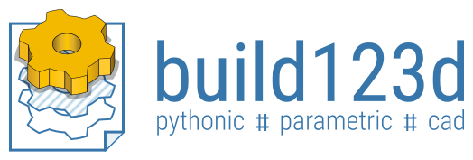

..
    build123d readthedocs documentation

    by:   Gumyr
    date: July 13th 2022

    desc: This is the documentation for build123d on readthedocs

    license:

        Copyright 2022 Gumyr

        Licensed under the Apache License, Version 2.0 (the "License");
        you may not use this file except in compliance with the License.
        You may obtain a copy of the License at

            http://www.apache.org/licenses/LICENSE-2.0

        Unless required by applicable law or agreed to in writing, software
        distributed under the License is distributed on an "AS IS" BASIS,
        WITHOUT WARRANTIES OR CONDITIONS OF ANY KIND, either express or implied.
        See the License for the specific language governing permissions and
        limitations under the License.

.. highlight:: python

########
About
########

Build123d is a Python-based, parametric (BREP) modeling framework for 2D and 3D CAD. 
Built on the Open Cascade geometric kernel, it provides a clean, fully Pythonic interface 
for creating precise models suitable for 3D printing, CNC machining, laser cutting, and 
other manufacturing processes. Models can be exported to popular CAD tools such as FreeCAD 
and SolidWorks.

Designed for modern, maintainable CAD-as-code, build123d combines clear architecture with 
expressive, algebraic modeling. It offers:

* Minimal or no internal state depending on mode
* Explicit 1D, 2D, and 3D geometry classes with well-defined operations
* Extensibility through subclassing and functional composition—no monkey patching
* Standards-compliant code (PEP 8, mypy, pylint) with rich pylance type hints
* Deep Python integration—selectors as lists, locations as iterables, and natural 
  conversions (``Solid(shell)``, ``tuple(Vector)``)
* Operator-driven modeling (``obj += sub_obj``, ``Plane.XZ * Pos(X=5) * Rectangle(1, 1)``) 
  for algebraic, readable, and composable design logic

With build123d, intricate parametric models can be created in just a few lines of readable 
Python code—as demonstrated by the tea cup example below.

.. dropdown:: Teacup Example

    .. literalinclude:: ../examples/tea_cup.py
        :language: build123d
        :start-after: [Code]
        :end-before: [End]

.. raw:: html

    
    <model-viewer poster="_images/tea_cup.png" src="_static/tea_cup.glb" alt="A tea cup modelled in build123d" auto-rotate camera-controls style="width: 100%; height: 50vh;"></model-viewer>

.. note::

  This documentation is available in
  `pdf <https://build123d.readthedocs.io/_/downloads/en/latest/pdf/>`_ and
  `epub <https://build123d.readthedocs.io/_/downloads/en/latest/epub/>`_ formats
  for reference while offline.

.. note::

  There is a `Discord <https://discord.com/invite/Bj9AQPsCfx>`_ server (shared with CadQuery) where
  you can ask for help in the build123d channel.

#################
Table Of Contents
#################

.. toctree::
    :maxdepth: 2

    introduction.rst
    installation.rst
    key_concepts.rst
    key_concepts_builder.rst
    key_concepts_algebra.rst
    moving_objects.rst
    OpenSCAD.rst
    introductory_examples.rst
    tutorials.rst
    objects.rst
    operations.rst
    topology_selection.rst
    builders.rst
    joints.rst
    assemblies.rst
    tips.rst
    import_export.rst
    advanced.rst
    cheat_sheet.rst
    external.rst
    builder_api_reference.rst
    direct_api_reference.rst

==================
Indices and tables
==================

* :ref:`genindex`
* :ref:`modindex`
* :ref:`search`
