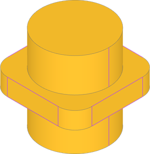
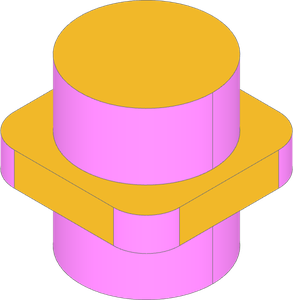
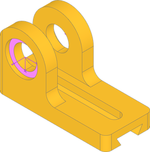
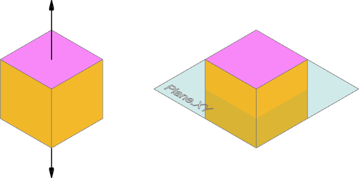
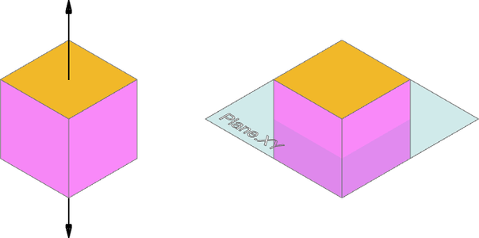
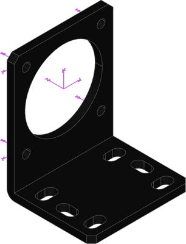
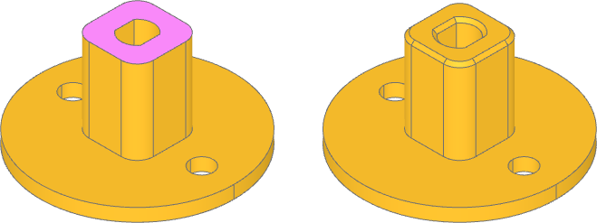
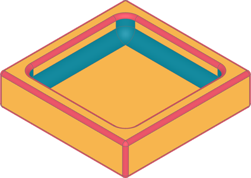

##################
Filter Examples
##################

.. _filter_geomtype:

GeomType
=============

:class:`~build_enums.GeomType` enums are shape type shorthands for ``Edge`` and ``Face``
objects. They are most helpful for filtering objects of that specific type for further
operations, and are sometimes necessary e.g. before sorting or filtering by radius.
``Edge`` and ``Face`` each support a subset of ``GeomType``:

* ``Edge`` can be type ``LINE``, ``CIRCLE``, ``ELLIPSE``, ``HYPERBOLA``, ``PARABOLA``, ``BEZIER``, ``BSPLINE``, ``OFFSET``, ``OTHER``
* ``Face`` can be type ``PLANE``, ``CYLINDER``, ``CONE``, ``SPHERE``, ``TORUS``, ``BEZIER``, ``BSPLINE``, ``REVOLUTION``, ``EXTRUSION``, ``OFFSET``, ``OTHER``

.. dropdown:: Setup

    .. literalinclude:: examples/filter_geomtype.py
        :language: build123d
        :lines: 3, 8-13

.. literalinclude:: examples/filter_geomtype.py
    :language: build123d
    :lines: 15

|

.. literalinclude:: examples/filter_geomtype.py
    :language: build123d
    :lines: 17

|

.. _filter_all_edges_circle:

All Edges Circle
========================

In this complete bearing block, we want to add joints for the bearings. These should be
located in the counterbore recess. One way to locate the joints is by finding faces with
centers located where the joints need to be located. Filtering for faces with only
circular edges selects the counterbore faces that meet the joint criteria.

.. dropdown:: Setup

    .. literalinclude:: examples/filter_all_edges_circle.py
        :language: build123d
        :lines: 3, 8-41

.. literalinclude:: examples/filter_all_edges_circle.py
    :language: build123d
    :lines: 43-47

|

.. _filter_axis_plane:

Axis and Plane
=================

Filtering by an Axis will select faces perpendicular to the axis. Likewise filtering by
Plane will select faces parallel to the plane.

.. dropdown:: Setup

    .. code-block:: build123d

        from build123d import *

        with BuildPart() as part:
            Box(1, 1, 1)

.. code-block:: build123d

    part.faces().filter_by(Axis.Z)
    part.faces().filter_by(Plane.XY)

|

It might be useful to filter by an Axis or Plane in other ways. A lambda can be used to
accomplish this with feature properties or methods. Here, we are looking for faces where
the dot product of face normal and either the axis direction or the plane normal is about
to 0. The result is faces parallel to the axis or perpendicular to the plane.

.. code-block:: build123d

    part.faces().filter_by(lambda f: abs(f.normal_at().dot(Axis.Z.direction) < 1e-6)
    part.faces().filter_by(lambda f: abs(f.normal_at().dot(Plane.XY.z_dir)) < 1e-6)

|

.. _filter_inner_wire_count:

Inner Wire Count
========================

This motor bracket imported from a step file needs joints for adding to an assembly.
Joints for the M3 clearance holes were already found by using the cylindrical face's
axis of rotation, but the motor bore and slots need specific placement. The motor bore
can be found by filtering for faces with 5 inner wires, sorting for the desired face,
and then filtering for the specific inner wire by radius.

- bracket STEP model: :download:`nema-17-bracket.step <examples/nema-17-bracket.step>`

.. dropdown:: Setup

    .. literalinclude:: examples/filter_inner_wire_count.py
        :language: build123d
        :lines: 4, 9-16

.. literalinclude:: examples/filter_inner_wire_count.py
    :language: build123d
    :lines: 18-21

|

Linear joints for the slots are appropriate for mating flexibility, but require more
than a single location. The slot arc centers can be used for creating a linear joint
axis and range. To do that we can filter for faces with 6 inner wires, sort for and
select the top face, and then filter for the circular edges of the inner wires.

.. literalinclude:: examples/filter_inner_wire_count.py
    :language: build123d
    :lines: 25-32

|

.. _filter_nested:

Nested Filters
========================

Filters can be nested to specify features by characteristics other than their own, like
child properties. Here we want to chamfer the mating edges of the D bore and square
shaft. A way to do this is first looking for faces with only 2 line edges among the
inner wires. The nested filter captures the straight edges, while the parent filter
selects faces based on the count. Then, from those faces, we filter for the wires with
any line edges.

.. dropdown:: Setup

    .. literalinclude:: examples/filter_nested.py
        :language: build123d
        :lines: 4, 9-22

.. literalinclude:: examples/filter_nested.py
    :language: build123d
    :lines: 26-32

|

.. _filter_shape_properties:

Shape Properties
========================

Selected features can be quickly filtered by feature properties. First, we filter by
interior and exterior edges using the ``Edge`` ``is interior`` property to apply
different fillets accordingly. Then the ``Face`` ``is_circular_*`` properties are used
to highlight the resulting fillets.

.. literalinclude:: examples/filter_shape_properties.py
    :language: build123d
    :lines: 3-4, 8-22

|