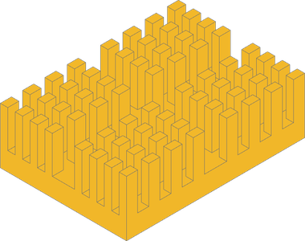
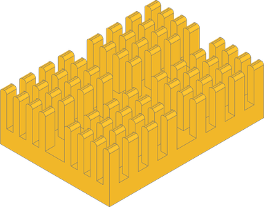
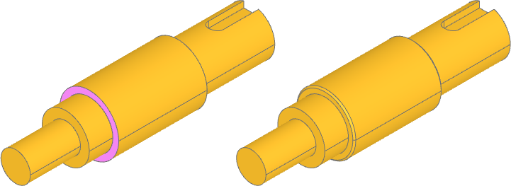
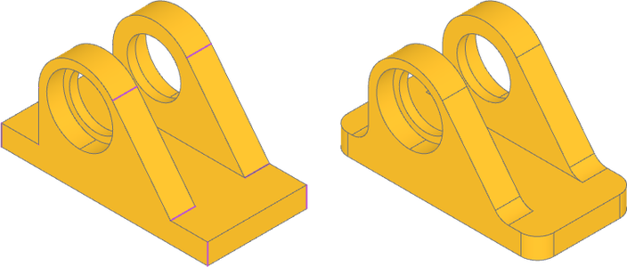
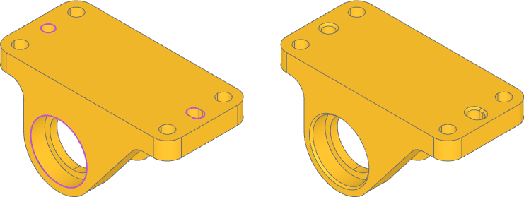

#################
Group Examples
#################

.. _group_axis:

Axis and Length
==================

This heatsink component could use fillets on the ends of the fins on the long ends. One
way to accomplish this is to filter by length, sort by axis, and slice the
result knowing how many edges to expect.

.. dropdown:: Setup

    .. literalinclude:: examples/group_axis.py
        :language: build123d
        :lines: 4, 9-17

|

However, ``group_by`` can be used to first group all the edges by z-axis position and then
group again by length. In both cases, you can select the desired edges from the last group.

.. literalinclude:: examples/group_axis.py
    :language: build123d
    :lines: 21-22

|

.. _group_hole_area:

Hole Area
==================

Callables are available to ``group_by``, like ``sort_by``. Here, the first inner wire
is converted to a face and then that area is the grouping criteria to find the faces
with the largest hole.

.. dropdown:: Setup

    .. literalinclude:: examples/group_hole_area.py
        :language: build123d
        :lines: 4, 9-17

.. literalinclude:: examples/group_hole_area.py
    :language: build123d
    :lines: 21-24

|

.. _group_properties_with_keys:

Properties with Keys
====================

Groups are usually selected by list slice, often smallest ``[0]`` or largest ``[-1]``,
but they can also be selected by key with the ``group`` method if the keys are known.
Starting with an incomplete bearing block we are looking to add fillets to the ribs
and corners. We know the edge lengths so the edges can be grouped by ``Edge.Length`` and
then the desired groups are selected with the ``group`` method using the lengths as keys.

.. dropdown:: Setup

    .. literalinclude:: examples/group_properties_with_keys.py
        :language: build123d
        :lines: 4, 9-26

.. literalinclude:: examples/group_properties_with_keys.py
    :language: build123d
    :lines: 30, 31

|

Next, we add alignment pin and counterbore holes after the fillets to make sure
screw heads sit flush where they overlap the fillet. Once that is done, it's time to
finalize the tight-tolerance bearing and pin holes with chamfers to make installation
easier. We can filter by ``GeomType.CIRCLE`` and group by ``Edge.radius`` to group the
circular edges. Again, the radii are known, so we can retrieve those groups directly
and then further specify only the edges the bearings and pins are installed from.

.. dropdown:: Adding holes

    .. literalinclude:: examples/group_properties_with_keys.py
        :language: build123d
        :lines: 35-43

.. literalinclude:: examples/group_properties_with_keys.py
    :language: build123d
    :lines: 47-50

|

Note that ``group_by`` is not the only way to capture edges with a known property
value! ``filter_by`` with a lambda expression can be used as well:

.. code-block:: build123d

    radius_groups = part.edges().filter_by(GeomType.CIRCLE)
    bearing_edges = radius_groups.filter_by(lambda e: e.radius == 8)
    pin_edges = radius_groups.filter_by(lambda e: e.radius == 1.5)
