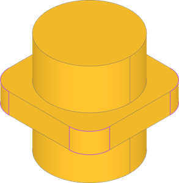
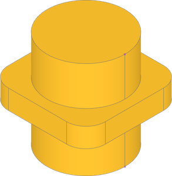
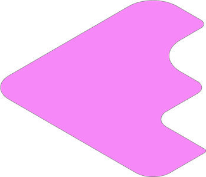
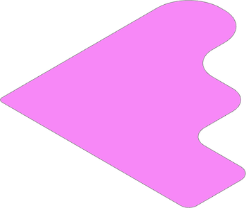
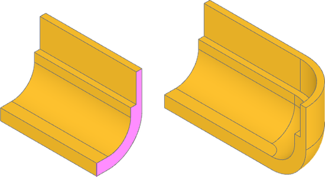
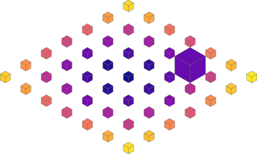
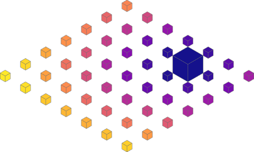

################
Sort Examples
################

.. _sort_sortby:

SortBy
=============

:class:`~build_enums.SortBy` enums are shape property shorthands which work across
``Shape`` multiple object types. ``SortBy`` is a criteria for both ``sort_by`` and
``group_by``.

* ``SortBy.LENGTH`` works with ``Edge``, ``Wire``
* ``SortBy.AREA`` works with ``Face``, ``Solid``
* ``SortBy.VOLUME`` works with ``Solid``
* ``SortBy.RADIUS`` works with ``Edge``, ``Face`` with :class:`~build_enums.GeomType` ``CIRCLE``, ``CYLINDER``, ``SPHERE``
* ``SortBy.DISTANCE`` works ``Vertex``, ``Edge``, ``Wire``, ``Face``, ``Solid``

``SortBy`` is often interchangeable with specific shape properties and can alternatively
be used with``group_by``.

.. dropdown:: Setup

    .. literalinclude:: examples/sort_sortby.py
        :language: build123d
        :lines: 3, 8-13

.. literalinclude:: examples/sort_sortby.py
    :language: build123d
    :lines: 19-22

|

.. literalinclude:: examples/sort_sortby.py
    :language: build123d
    :lines: 24-27

|

.. _sort_along_wire:

Along Wire
=============

Vertices selected from an edge or wire might have a useful ordering when created from
a single object, but when created from multiple objects, the ordering not useful. For
example, when applying incrementing fillet radii to a list of vertices from the face,
the order is random.

.. dropdown:: Setup

    .. literalinclude:: examples/sort_along_wire.py
        :language: build123d
        :lines: 3, 8-12

.. literalinclude:: examples/sort_along_wire.py
    :language: build123d
    :lines: 14-15

|

Vertices may be sorted along the wire they fall on to create order. Notice the fillet
radii now increase in order.

.. literalinclude:: examples/sort_along_wire.py
    :language: build123d
    :lines: 26-28

|

.. _sort_axis:

Axis
=========================

Sorting by axis is often the most straightforward way to optimize selections. In this
part we want to revolve the face at the end around an inside edge of the completed
extrusion. First, the face to extrude can be found by sorting along x-axis and the revolution
edge can be found sorting along y-axis.

.. dropdown:: Setup

    .. literalinclude:: examples/sort_axis.py
        :language: build123d
        :lines: 4, 9-18

.. literalinclude:: examples/sort_axis.py
    :language: build123d
    :lines: 22-24

|

.. _sort_distance_from:

Distance From
=========================

A ``sort_by_distance`` can be used to sort objects by their distance from another object.
Here we are sorting the boxes by distance from the origin, using an empty ``Vertex``
(at the origin) as the reference shape to find distance to.

.. dropdown:: Setup

    .. literalinclude:: examples/sort_distance_from.py
        :language: build123d
        :lines: 2-5, 9-13

.. literalinclude:: examples/sort_distance_from.py
    :language: build123d
    :lines: 15-16

|

The example can be extended by first sorting the boxes by volume using the ``Solid``
property ``volume``, and getting the last (largest) box. Then, the boxes sorted by
their distance from the largest box.

.. literalinclude:: examples/sort_distance_from.py
    :language: build123d
    :lines: 19-20

|