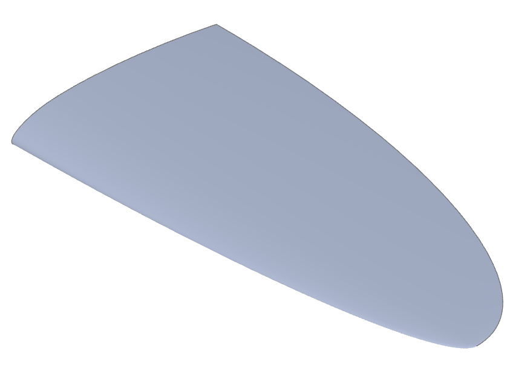

#############################################
Tutorial: Spitfire Wing with Gordon Surface
#############################################

In this advanced tutorial we construct a Supermarine Spitfire wing as a
:meth:`~topology.Face.make_gordon_surface`—a powerful technique for surfacing
from intersecting *profiles* and *guides*. A Gordon surface blends a grid of
curves into a smooth, coherent surface as long as the profiles and guides
intersect consistently.

.. note::
   Gordon surfaces work best when *each profile intersects each guide exactly
   once*, producing a well‑formed curve network.

Overview
========

We will:

1. Define overall wing dimensions and elliptic leading/trailing edge guide curves
2. Sample the guides to size the root and tip airfoils (different NACA profiles)
3. Build the Gordon surface from the airfoil *profiles* and wing‑edge *guides*
4. Close the root with a planar face and build the final :class:`~topology.Solid`

.. raw:: html

    
    <model-viewer poster="_images/spitfire_wing.png" src="_static/spitfire_wing.glb" alt="A tea cup modelled in build123d" auto-rotate camera-controls style="width: 100%; height: 50vh;"></model-viewer>

Step 1 — Dimensions and guide curves
====================================

We model a single wing (half‑span), with an elliptic leading and trailing edge.
These two edges act as the *guides* for the Gordon surface.

.. literalinclude:: spitfire_wing_gordon.py
    :language: build123d
    :start-after: [Code]
    :end-before: [AirfoilSizes]

Step 2 — Root and tip airfoil sizing
====================================

We intersect the guides with planes normal to the span to size the airfoil sections.
The resulting chord lengths define uniform scales for each airfoil curve.

.. literalinclude:: spitfire_wing_gordon.py
    :language: build123d
    :start-after: [AirfoilSizes]
    :end-before: [Airfoils]

Step 3 — Build airfoil profiles (root and tip)
==============================================

We place two different NACA airfoils on :data:`Plane.YZ`—with the airfoil origins
shifted so the leading edge fraction is aligned—then scale to the chord lengths
from Step 2.

.. literalinclude:: spitfire_wing_gordon.py
    :language: build123d
    :start-after: [Airfoils]
    :end-before: [Profiles]

Step 4 — Gordon surface construction
====================================

A Gordon surface needs *profiles* and *guides*. Here the airfoil edges are the
profiles; the elliptic edges are the guides. We also add the wing tip section
so the profile grid closes at the tip.

.. literalinclude:: spitfire_wing_gordon.py
    :language: build123d
    :start-after: [Profiles]
    :end-before: [Solid]

Step 5 — Cap the root and create the solid
==========================================

We extract the closed root edge loop, make a planar cap, and form a solid shell.

.. literalinclude:: spitfire_wing_gordon.py
    :language: build123d
    :start-after: [Solid]
    :end-before: [End]

Tips for robust Gordon surfaces
-------------------------------

- Ensure each profile intersects each guide once and only once
- Keep the curve network coherent (no duplicated or missing intersections)
- When possible, reuse the same :class:`~topology.Edge` objects across adjacent faces

Complete listing
================

For convenience, here is the full script in one block:

.. literalinclude:: spitfire_wing_gordon.py
    :language: build123d
    :start-after: [Code]
    :end-before: [End]
