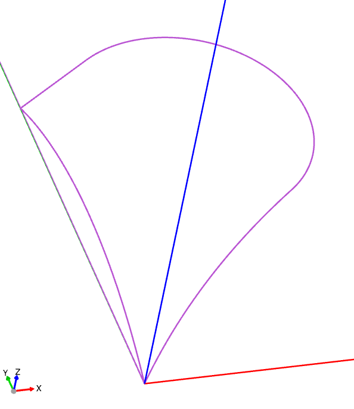
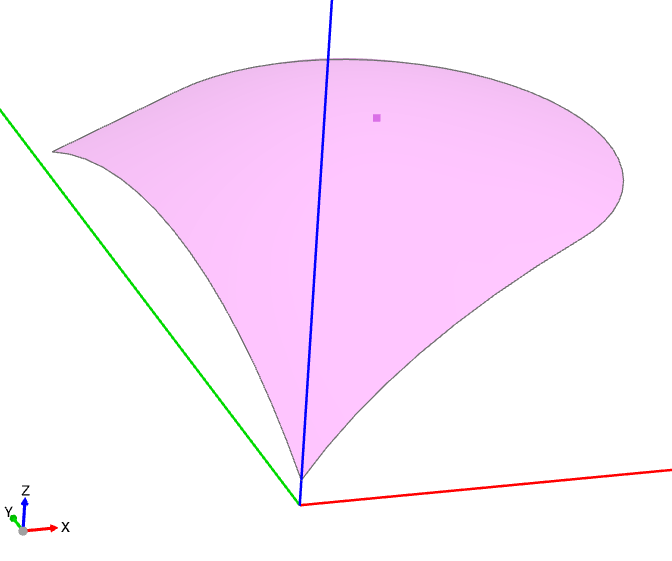
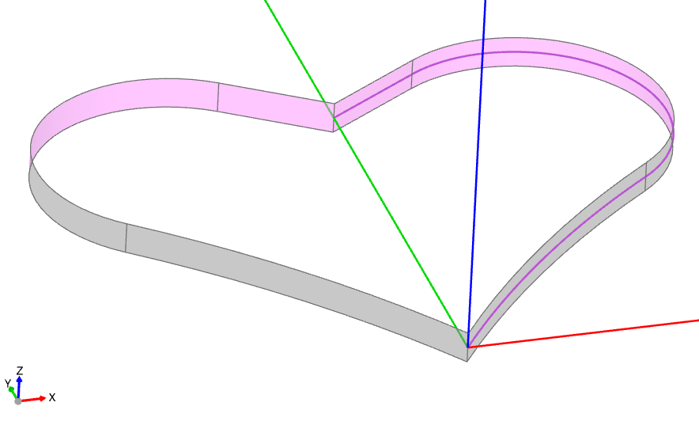
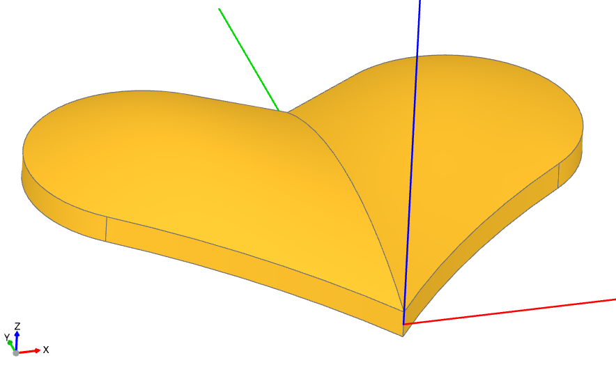

##################################
Tutorial: Heart Token (Basics)
##################################

This hands‑on tutorial introduces the fundamentals of surface modeling by building
a heart‑shaped token from a small set of non‑planar faces. We’ll create
non‑planar surfaces, mirror them, add side faces, and assemble a closed shell
into a solid.

As described in the `topology_` section, a BREP model consists of vertices, edges, faces,
and other elements that define the boundary of an object. When creating objects with
non-planar faces, it is often more convenient to explicitly create the boundary faces of
the object. To illustrate this process, we will create the following game token:

.. raw:: html

    
    <model-viewer poster="_images/heart_token.png" src="_static/heart_token.glb" alt="Game Token" auto-rotate camera-controls style="width: 100%; height: 50vh;"></model-viewer>

Useful :class:`~topology.Face` creation methods include
:meth:`~topology.Face.make_surface`, :meth:`~topology.Face.make_bezier_surface`,
and :meth:`~topology.Face.make_surface_from_array_of_points`. See the
:doc:`tutorial_surface_modeling` overview for the full list.

In this case, we'll use the ``make_surface`` method, providing it with the edges that define
the perimeter of the surface and a central point on that surface.

To create the perimeter, we'll define the perimeter edges. Since the heart is
symmetric, we'll only create half of its surface here:

.. literalinclude:: heart_token.py
    :language: build123d
    :start-after: [Code]
    :end-before: [SurfaceEdges]

Note that ``l4`` is not in the same plane as the other lines; it defines the center line
of the heart and archs up off ``Plane.XY``.

In preparation for creating the surface, we'll define a point on the surface:

.. literalinclude:: heart_token.py
    :language: build123d
    :start-after: [SurfaceEdges]
    :end-before: [SurfacePoint]

We will then use this point to create a non-planar ``Face``:

.. literalinclude:: heart_token.py
    :language: build123d
    :start-after: [SurfacePoint]
    :end-before: [Surface]

Note that the surface was raised up by 0.5 using an Algebra expression with Pos. Also,
note that the ``-`` in front of ``Face`` simply flips the face normal so that the colored
side is up, which isn't necessary but helps with viewing.

Now that one half of the top of the heart has been created, the remainder of the top
and bottom can be created by mirroring:

.. literalinclude:: heart_token.py
    :language: build123d
    :start-after: [Surface]
    :end-before: [Surfaces]

The sides of the heart are going to be created by extruding the outside of the perimeter
as follows:

.. literalinclude:: heart_token.py
    :language: build123d
    :start-after: [Surfaces]
    :end-before: [Sides]

With the top, bottom, and sides, the complete boundary of the object is defined. We can
now put them together, first into a :class:`~topology.Shell` and then into a
:class:`~topology.Solid`:

.. literalinclude:: heart_token.py
    :language: build123d
    :start-after: [Sides]
    :end-before: [Solid]

.. note::
    When creating a Solid from a Shell, the Shell must be "water-tight," meaning it
    should have no holes. For objects with complex Edges, it's best practice to reuse
    Edges in adjoining Faces whenever possible to avoid slight mismatches that can
    create openings.

Finally, we'll create the frame around the heart as a simple extrusion of a planar
shape defined by the perimeter of the heart and merge all of the components together:

.. literalinclude:: heart_token.py
    :language: build123d
    :start-after: [Solid]
    :end-before: [End]

Note that an additional planar line is used to close ``l1`` and ``l3`` so a ``Face``
can be created. The :func:`~operations_generic.offset` function defines the outside of
the frame as a constant distance from the heart itself.

Summary
-------

In this tutorial, we've explored surface modeling techniques to create a non-planar
heart-shaped object using build123d. By utilizing methods from the :class:`~topology.Face`
class, such as :meth:`~topology.Face.make_surface`, we constructed the perimeter and
central point of the surface. We then assembled the complete boundary of the object
by creating the top, bottom, and sides, and combined them into a :class:`~topology.Shell`
and eventually a :class:`~topology.Solid`. Finally, we added a frame around the heart
using the :func:`~operations_generic.offset` function to maintain a constant distance
from the heart.

Next steps
----------

Continue to :doc:`tutorial_spitfire_wing_gordon` for an advanced example using
:meth:`~topology.Face.make_gordon_surface` to create a Supermarine Spitfire wing.
